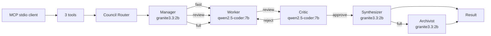

# sovereign-exoself-mcp

Local MCP server for personal AI Council. Routes tasks through manager, worker, critic, synthesizer, and archivist with fast/review/full paths. Uses SQLite memory with WAL and FTS5. Supports mock, Ollama, and OpenRouter providers.

## Architecture



## Model Configuration (Config B)

| Role | Model | Rationale |
|------|-------|-----------|
| Manager | granite3.3:2b | Fast routing decisions |
| Worker | qwen2.5-coder:7b | Quality code execution |
| Critic | qwen2.5-coder:7b | Reliable code review |
| Synthesizer | granite3.3:2b | Fast result merging |
| Archivist | granite3.3:2b | Fast memory extraction |

Benchmark: 1504ms avg, 3428ms P95, 100% success rate, 0 timeouts.

## Quick Start

Requirements: Ubuntu/Linux, Python 3.14, `uv`.

```bash
cd /home/hat/AionUI/sovereign-exoself-mcp
bash scripts/install.sh
bash scripts/smoke_test.sh --mock
```

`--mock` mode requires no API key and is useful for offline validation. For real inference, run the server directly with a provider (see below). `scripts/generate_client_configs.py` auto-generates host snippets (`dist/`) that enable a real provider: `ollama` by default, `openrouter` when `OPENROUTER_API_KEY` is present.

### Ollama Mode

```bash
# Pull required models
ollama pull granite3.3:2b
ollama pull qwen2.5-coder:7b

# Run with Ollama
SOVEREIGN_PROVIDER_MODE=ollama \
uv run python -m sovereign_exoself_mcp
```

### OpenRouter Mode

```bash
# Secrets are environment-only: store the key in the gitignored `.env` file
echo "OPENROUTER_API_KEY=sk-or-v1-..." >> .env

SOVEREIGN_PROVIDER_MODE=openrouter \
uv run python -m sovereign_exoself_mcp
```

## Council Routes

### Fast Path (Default)
Manager → Worker → Result. Used for simple questions, facts, quick analysis.

### Review Path
Manager → Worker → Critic → Synthesizer → Result. Used for code changes, architecture decisions.

### Full Council
Manager → Worker → Critic → Synthesizer → Archivist → Result. Used for complex tasks requiring memory.

## API Tools

### council_run
```json
{
  "task": "Review and improve the configuration loader.",
  "mode": "auto",
  "budget": "low",
  "worker_profile": null,
  "needs_memory": null,
  "max_rounds": null,
  "route_override": null
}
```

Mode values: `auto` (manager decides), `code`, `analysis`, `decision`. As a shorthand, `mode` also accepts `fast`, `review`, or `full` to force a route directly. An explicit `route_override` (`fast`/`review`/`full`) always wins when provided.

Response includes: `run_id`, `status`, `route`, `models`, `result`, `metrics`, `memory_updates`, `warnings`

### memory_manage
```json
{
  "action": "search",
  "query": "design decisions"
}
```

Actions: `search`, `store`, `list`, `delete`, `export`, `profile`

### system_status
Returns health, provider mode, model mapping, prompt versions, active runs, Ollama status.

## Changing Models

```bash
# Environment variables
export SOVEREIGN_OLLAMA_WORKER_MODEL=qwen3:8b
export SOVEREIGN_OLLAMA_MANAGER_MODEL=gemma2:2b

# Or config file
cp config/council.example.yaml config/council.yaml
# Edit config/council.yaml
```

## Worker Profiles

| Profile | Purpose |
|---------|---------|
| code_engineer | Code implementation, debugging, refactoring |
| system_engineer | Infrastructure, DevOps, system design |
| researcher | Information gathering, analysis |
| technical_writer | Documentation, prose |
| planner | Task decomposition, project planning |
| general_operator | Default fallback |

## Running Benchmark

```bash
# Mock benchmark
python benchmarks/benchmark.py --mode mock

# Live benchmark (requires Ollama with models)
OLLAMA_TEST_MODEL=qwen2.5-coder:7b python benchmarks/benchmark.py --mode ollama
```

## System Status

```bash
# Via MCP tool
system_status({})

# Via CLI
uv run python -c "import asyncio; from sovereign_exoself_mcp.providers import probe_ollama; print(asyncio.run(probe_ollama('http://127.0.0.1:11434', 5)))"
```

## Rollback

1. Set `SOVEREIGN_PROVIDER_MODE=mock`
2. Remove new environment variables
3. Revert code changes

## Adding Worker Profiles

1. Create `src/sovereign_exoself_mcp/prompts/profiles/<name>.txt`
2. Add to `PROFILES` list in `prompts.py`
3. Use in requests: `{"worker_profile": "<name>"}`

## Environment Variables

See `.env.example` for all available settings.

## Documentation

- [Council Architecture](docs/council-architecture.md)
- [Council Prompts](docs/council-prompts.md)
- [Routing and Execution](docs/routing-and-execution.md)
- [Model Configuration](docs/model-configuration.md)
- [Migration Guide](docs/migration-guide.md)
- [Troubleshooting](docs/TROUBLESHOOTING.md)

## Testing

```bash
# Run all tests
python -m pytest tests/ -v

# Run specific test suite
python -m pytest tests/unit/test_prompts.py -v
python -m pytest tests/unit/test_router.py -v
python -m pytest tests/unit/test_schemas.py -v
```

## License

MIT
